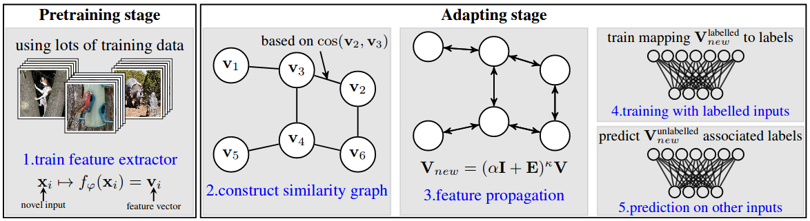

Exploiting Unsupervised Inputs for Accurate Few-Shot Classification
=======

A few-shot classification algorithm: [Exploiting Unsupervised Inputs for Accurate Few-Shot Classification](https://arxiv.org/pdf/2001.09849.pdf)




Running the code
------------
**Dataset**: miniImageNet, CUB, CIFAR-FS

***Donwloading the dataset and create base/val/novel splits***:

miniImageNet
* Change directory to filelists/miniImagenet/
* Run 'source ./download_miniImagenet.sh'

CUB

* Change directory to filelists/CUB/
* Run 'source ./download_CUB.sh' 

CIFAR-FS
* Download [CIFAR-FS](https://drive.google.com/file/d/1pTsCCMDj45kzFYgrnO67BWVbKs48Q3NI/view)
* Decompress and change the filename to 'cifar-FS'
* Move the datafile to filelists/cifar/
* Run 'python write_cifar_filelist.py'
 
**Training backbone**

For miniImageNet/CUB<br/>
```
python train.py --dataset [miniImagenet/CUB] --method [S2M2_R/rotation] --model [WideResNet28_10/ResNet18]
```

For CIFAR-FS<br/>
```
python train_cifar.py --dataset cifar --method [S2M2_R/rotation] --model [WideResNet28_10/ResNet18]
```

**Saving the novel class features of a trained backbone for the evaluation**
```
python save_plk.py --dataset [miniImagenet/CUB] --method S2M2_R --model [WideResNet28_10/ResNet18]
```

**Fetching trained WideResNet_28_10 backbones and saved novel class features**

Create an empty 'checkpoints' directory inside 'transfer-sgc'

The backbone and features for each dataset can be downloaded from this link: 'https://drive.google.com/drive/folders/1uhX_YldcpVBzK2giGn-qZEHGSd6cCeBy?usp=sharing
' 

Untar the downloaded file and move it into 'checkpoints' folder.

**Evaluating the few-shot classification performance**
```
python test_standard.py
```

References
------------
[A Closer Look at Few-shot Classification](https://openreview.net/pdf?id=HkxLXnAcFQ)

[Charting the Right Manifold: Manifold Mixup for Few-shot Learning](https://arxiv.org/pdf/1907.12087v3.pdf)

[Manifold Mixup: Better Representations by Interpolating Hidden States](https://arxiv.org/pdf/1806.05236.pdf)

[SimpleShot: Revisiting Nearest-Neighbor Classification for Few-Shot Learning](https://arxiv.org/pdf/1911.04623v2.pdf)

[Simplifying Graph Conv Neural Network](https://arxiv.org/pdf/1902.07153.pdf)

